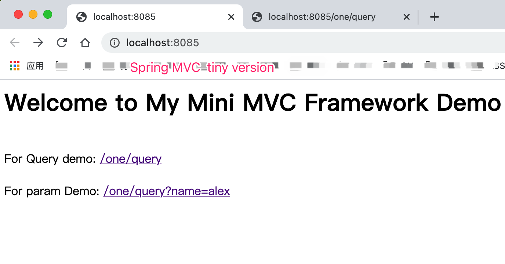

# My Mini MVC Framework Demo

Spring Framework Mini Edition!

Just for learning and Understanding spring framework src!

## 手工精简版的Spring MVC Framework

- LoadConfig 包括 配置加载;
- ScanPackage  扫包;
- Instance , IOC Container 实例化, IOC容器;
- Autowrited 自定义自动依赖注入
- InitHandlerMapping 初始化请求映射等

自定义注解的使用;

反射调用;

接口代理等......

